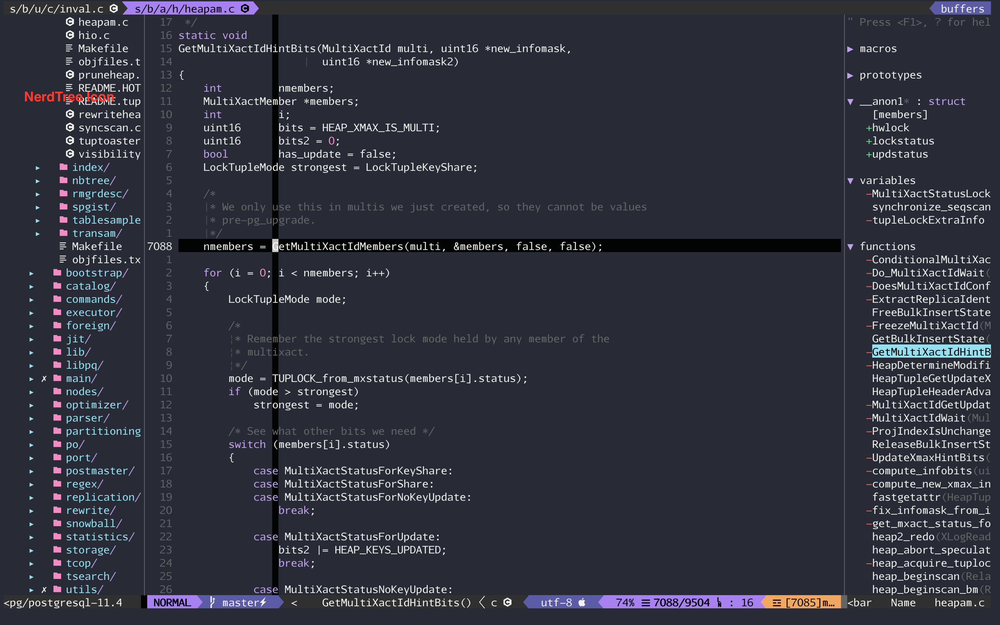

# c-g vim 
----
c-g vim is an vim-ide used for developing in c and golang enviroment.
screenshot:
1. clang-screen:
   
2. golang-screen:
   
**Feature simply introduce:**
- Clang coding and tags jump, autocomplete.
- Golang coding and tags jump, autocomplete, dlv debug.
- Golang debug and code in same buffer.
- File search and tags search.
- Auxiliary develop tools, such as PlantUml, graphviz.
---
### Requirement:
- [Neovim](ttps://github.com/neovim/neovim) Better Version: 0.5.0.
- [Golang](https://golang.google.cn/dl/) Better Version: 1.13.x.
- [Delve](https://github.com/leafji/delve)  Better Version: using my-fork delve version.
- Python3.x
### How to Install?
- Install neovim.
- Clone this respo: git clone git@github.com:leafji/c-gvim.git ~/.vim.
- Link init.vim in ~/.config/nvim/init.vim to ~/.vim/init.vim  

    **ln -s ~/.vim/init.vim ~/.config/nvim/init.vim**
- Enter vim do **:PlugInstall** to install all plugin 
- Compile YouComplete for auto complete, plz reference:[YouCompleteMe](https://github.com/ycm-core/YouCompleteMe)

    cd ~/.vim/plugged/YouCompleteMe
    python3 install.py --clang-completer --clangd-completer 

### Vim-Config:
- Main vimrc File: ~/.vim/init.vim
- Main plugin File: ~/.vim/vimrc/plug.vim
- Main basic File: ~/.vim/vimrc/basic.vim
- Main bind-key File: ~/.vim/vimrc/bindkey.vim
- Main plugin config File: ~/.vim/vimrc/config.vim

suggest config some alias in ~/.bash_alias to open these vimrc directly:
```
alias vb='vim ~/.vim/vimrc/basic.vim'
alias vp='vim ~/.vim/vimrc/plug.vim'
alias vc='vim ~/.vim/vimrc/config.vim'
alias vk='vim ~/.vim/vimrc/bindkey.vim'
```
### Some-key-plug:
Golang code and debug:
- [vim-go](https://github.com/fatih/vim-go) Golang debug key plug.
- [NeovimGdb](https://github.com/leafji/NeovimGdb) Using dlv to debug binary or gofile in same plane.
- [tagbar](https://github.com/majutsushi/tagbar) It will generate taglist in right with golang.

Clang code and debug:
- [lldb](https://github.com/dbgx/lldb.nvim) Mac lldb used for debug clang.

Code read and tags search:
- [fzf](https://github.com/junegunn/fzf) Used for search files and tags.
- [vim-gutentags](https://github.com/ludovicchabant/vim-gutentags) It can auto generate and update tags.
- [NerdTree](https://github.com/scrooloose/nerdtree)  File read in tree buffer.
- [ag](https://github.com/rking/ag.vim) Search keyword in path.
- [interestingwords](https://github.com/lfv89/vim-interestingwords)  insterestingwords show highlight in special colors.

UI better:
- [vim-airline](https://github.com/vim-airline/vim-airline) airline better show line stat
- [fatih/molokai](https://github.com/fatih/molokai) a best golang vim theme
- [mhinz/vim-startify](https://github.com/mhinz/vim-startify) a better start ui and show some mru files
- [NerdTreeIcon](https://www.nerdfonts.com/font-downloads) Aurulent Sans Mono
 

### Some Bind-key
num|bind-key|action
-|-|-
1|F2| open nerdtree
2|,ct| generate ctags
3|,tl| open Taglist
4|,vr| open vimrc in newtab
5|C-n| switch to next tab
6|C-p| switch to prev tab
7|F3|  ag search
8|c-f|  search files in current path
9|,b|  search buffer
10|c-s| symbol search
12|,tg | open tagbar
13|F5 | dlv debug binary
14|F6 | dlv debug file
15|c-g | youdao dic search current word

### ToBe Enhance
1. Dlv debug enhancement, include pretty show variable, breakpoint list.
2. Markdown preview.
3. ...